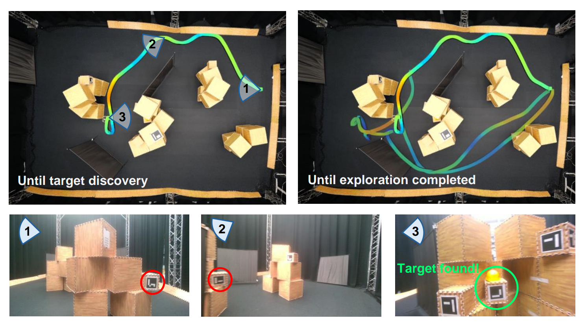

# STEM: Semantic Target Search and Exploration using MAVs

Nikhil Sethi, Max Lodel, Laura Ferranti, Robert Babuska, Javier Alonso-Mora

### Overview
Autonomous target search is crucial for deploying Micro Aerial Vehicles (MAVs) in emergency
response and rescue missions. Existing approaches either focus on 2D semantic navigation in struc-
tured environments – which is less effective in complex 3D settings, or on robotic exploration in
cluttered spaces – which often lacks the semantic reasoning needed for efficient target search. This
thesis overcomes these limitations by proposing a novel framework that utilizes semantic reasoning to
minimize target search and exploration time in unstructured 3D environments using an MAV. Specif-
ically, the open vocabulary inference capabilities of Large Language Models are employed to embed
semantic relationships in segmentation images. An active perception pipeline is then developed to
guide exploration toward semantically relevant regions of 3D space by biasing frontiers and selecting
informative viewpoints. Finally, a combinatorial optimization problem is solved using these viewpoints
to create a plan that balances information gain with time costs, facilitating rapid location of the tar-
get. Evaluations in complex simulation environments show that the proposed method consistently
outperforms baselines by quickly finding the target while maintaining reasonable exploration times.
Real-world experiments with an MAV further demonstrate the method’s ability to handle practical
constraints like limited battery life, small sensor range, and semantic uncertainty.

## Installation

### For users

Download the 'Dockerfile' from the root of this repository and launch the following command where the file is located.
```
docker build --ssh default -t stem .
```
It should take about 20-30 minutes to build. time to doodle something on your notebook.

Download and execute the 'docker_run.sh' script located in the root of this repository. 
```
./docker_run.sh 
```

### For developers
The devcontainer environment in vscode provides a neat way of developing with containers. First install this extension in vscode.

Create a ros workspace and clone the repo
```bash
mkdir -p stem_ws/src
cd stem_ws/src
git clone git@github.com:nikhil-sethi/thesis.git
cd ../..
```

Link the .devcontainer folder at the root to let vscode know
```bash
ln -s stem_ws/src/thesis/.devcontainer stem_ws/.devcontainer
xhost +local:root # to enable display in the docker container
code .
```
Open vscode in the `stem_ws` directory and choose the 'Reopen in container' option.

> Note: To display on Rviz, it is highly recommended that you have a dedicated GPU and uncomment the `--gpus=all` and `"NVIDIA_DRIVER_CAPABILITIES": "all"` line in the `.devcontainer/devcontainer.json` file. Displaying everything on a CPU can lead to significant lag.


## Run


### Simulation

Inside the container:

```bash
source devel/setup.bash
source src/thesis/setup_paths.bash  && # need this for px4 sitl and gazebo

roslaunch stem_bringup main.launch sim:=true world:=earthquake
```

If everything went well you should see an axis marker for the drone and camera in Rviz along with occupancy map. If not, go to the debugging section.

cmdline options
`sim`: true if you want simulation only

`gui`: true if you want Gazebo graphics. Note, this might slow cause processing problems on less powerful PCs

`world`: `earthquake` or `cave`. Empty is also possible; it simulates a small lab environment.

> the first time you run the simulation after building the docker image, it might take some time for gazebo to download assets. As Tame Impala says: Let it happen.

### Hardware testing

Make sure the ROS_MASTER_URI and ROS_IP are set correctly on both the OBC and your laptop.

- Development PC

```bash
terminal 1: roslaunch stem_bringup main.launch sim:=false
terminal 2: roslaunch stem_bringup rviz.launch
```

- Host OBC (Nvidia Jetson Xavier)

(Assuming packages are sourced, built and everything)

```bash
terminal 1: roslaunch vicon_bridge mantis.launch
terminal 2: roslaunch realsense2_camera rs.launch
terminal 3: roslaunch px4_tools px4_tools.launch sim:=false
```

For more information on debugging and FAQs see [debugging.md](docs/debugging.md).
